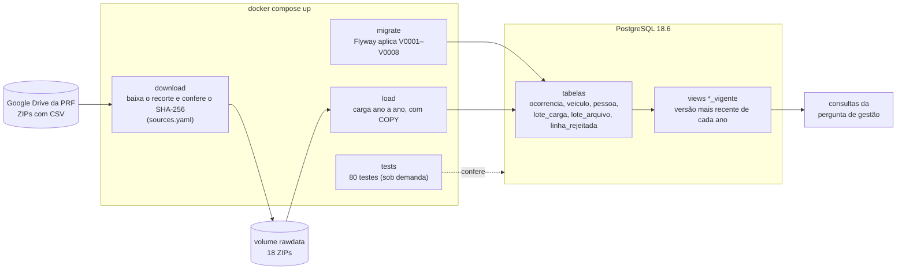
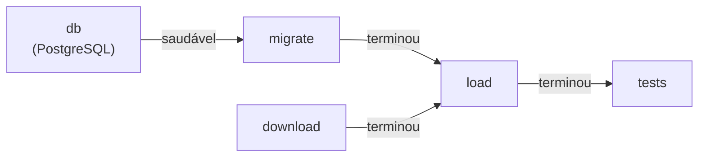
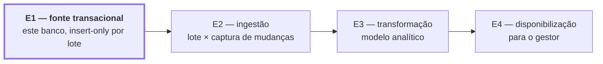
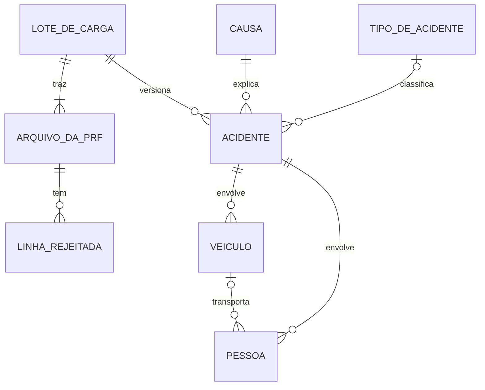
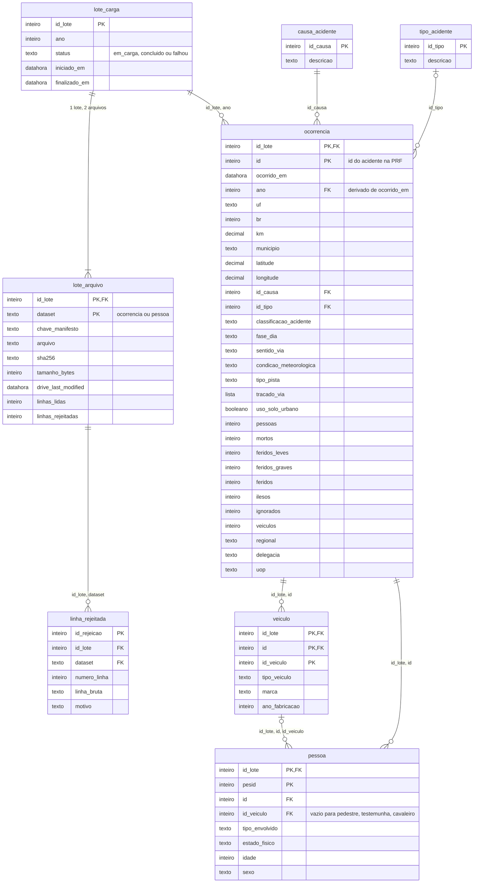
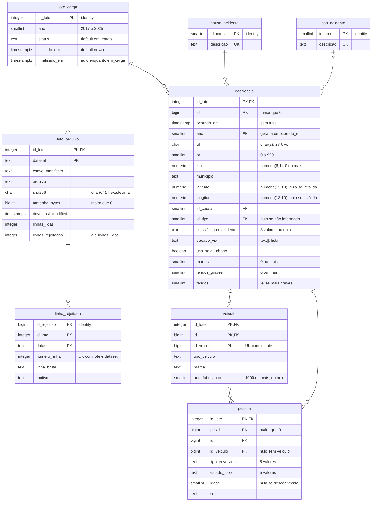

# Arquitetura e modelos de dados

Os diagramas desta página saem do que está implementado: o
[`docker-compose.yml`](../docker-compose.yml) e as migrações em
[`db/migrations/`](../db/migrations/V0001__lote_carga.sql). O raciocínio por trás do modelo
está em [Modelagem da origem](modelagem-origem.md) e no
[ADR 0001](adr/0001-modelo-normalizado-insert-only-versionado-por-lote.md).

1. TOC
{:toc}

---

## Arquitetura e pipeline

Um `docker compose up` sobe quatro serviços. `migrate` e `download` rodam em paralelo, e
`load` só começa quando os dois terminam sem erro.

**Ordem dos serviços** (`depends_on` do compose):

**Onde a E1 fica no ciclo de vida do dado:**

As republicações da PRF, guardadas como lotes novos, são o material da E2.

---

## Modelo conceitual

As ideias do domínio e como se relacionam, sem detalhe de banco. Um acidente envolve
veículos e pessoas; uma pessoa pode estar num veículo ou não (pedestre, testemunha,
cavaleiro); cada acidente pertence a uma versão (lote) carregada da PRF.

Como ler: `||` é "exatamente um", `|o` é "zero ou um", `o{` é "zero ou muitos" e `|{` é
"um ou muitos". Por exemplo, uma pessoa está em **zero ou um** veículo, e um veículo
transporta **zero ou muitas** pessoas.

---

## Modelo lógico

As tabelas, as colunas e as chaves, ainda sem os tipos do PostgreSQL. **PK** é a chave
primária (identifica a linha) e **FK** a chave estrangeira (liga a outra tabela). Toda chave de
dado começa por `id_lote`, porque a mesma linha da PRF pode existir em várias versões.

Decisões de normalização (detalhes em [Modelagem da origem](modelagem-origem.md)):

- O arquivo de pessoa da PRF mistura duas coisas: com `pesid = 0` a linha é um **veículo sem
  pessoa**, e com `id_veiculo = 0` é uma **pessoa sem veículo**. Por isso viram duas tabelas.
- Os dados do acidente, que se repetem em cada linha de pessoa, ficam só em `ocorrencia`.
- Causa e tipo de acidente viram tabelas de domínio, porque se repetem em 632 mil linhas.
- **Desnormalização proposital:** as contagens (`mortos`, `feridos_graves`...) ficam em
  `ocorrencia`, mesmo sendo deriváveis de `pessoa`, porque são o filtro da pergunta de gestão.

---

## Modelo físico

O que existe no PostgreSQL, com os tipos, as restrições, os índices e as views.

Em `ocorrencia`, o diagrama mostra só as colunas com restrição. As demais (`fase_dia`,
`sentido_via`, `condicao_meteorologica`, `tipo_pista`, `pessoas`, `feridos_leves`, `ilesos`,
`ignorados`, `veiculos`, `regional`, `delegacia`, `uop`) estão no modelo lógico e em
[`V0003__ocorrencia.sql`](../db/migrations/V0003__ocorrencia.sql).

**Restrições que vão além das colunas:**

| Tabela | Restrição | Garante |
|---|---|---|
| `lote_carga` | índice único parcial em `ano` com `status = 'em_carga'` | no máximo uma carga em andamento por ano |
| `ocorrencia` | FK `(id_lote, ano)` → `lote_carga` | o acidente é do ano do lote que o carregou |
| `ocorrencia` | `(latitude IS NULL) = (longitude IS NULL)` | coordenada completa ou nenhuma |
| `ocorrencia` | `feridos = feridos_leves + feridos_graves` | contagens coerentes |
| `veiculo` | `UNIQUE (id_lote, id_veiculo)` | um veículo não aparece em dois acidentes |
| `pessoa` | FK `(id_lote, id, id_veiculo)` → `veiculo` | o veículo da pessoa é do mesmo acidente |
| `pessoa` | `id_veiculo` nulo ⇔ pedestre, testemunha ou cavaleiro | pessoa sem veículo só nesses casos |

**Índices** (além dos das PKs):

| Índice | Colunas | Para quê |
|---|---|---|
| `ocorrencia_grave_trecho_idx` | `(id_lote, br, uf, km)`, parcial: só acidentes graves | ranking de trechos graves por ano |
| `ocorrencia_trecho_idx` | `(br, uf, km)` | detalhe de um trecho |
| `pessoa_ocorrencia_veiculo_idx` | `(id_lote, id, id_veiculo)` | as duas FKs de pessoa |

**Views** (tabelas virtuais, só leitura):

| View | Mostra |
|---|---|
| `lote_vigente` | o maior lote concluído de cada ano |
| `ocorrencia_vigente`, `veiculo_vigente`, `pessoa_vigente` | só as linhas do lote vigente; é o que as consultas usam |

**Carimbos de tempo:** `ocorrido_em` é `timestamp` **sem fuso** (hora local do acidente; a PRF
não informa o fuso), e os de ingestão são `timestamptz` (com fuso). Os tipos são diferentes de
propósito, para a hora do acidente não ser comparada com a hora da carga.
